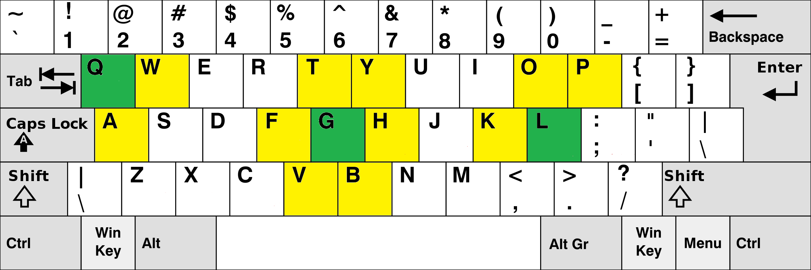

Описание задачи
---
Необходимо разработать программу, которая анализирует словарь
английских слов и определяет, сколько из них могут быть набраны на
QWERTY-клавиатуре с английским языком, передвигаясь только по смежным
клавишам. При этом можно нажимать одну и ту же клавишу дважды подряд.  

**Условия**  
 - Входные данные: файл со списком английских слов (одно слово на строку).
 - Раскладка клавиатуры: стандартная английская QWERTY.
 - Клавиши считаются смежными, если они находятся горизонтально или
 вертикально рядом друг с другом. Диагональное расположение также считается
 смежным, но только для клавиш, расположенных на одинаковом расстоянии от
 левого края. Так, 's' и 'w', а также 's' и 'z' считаются смежными, но 's'
 и 'q' - не считаются смежными.
 - Каждую клавишу можно нажимать дважды подряд.

**Задача**  
Посчитать и вывести количество английских слов, которые можно
набрать, используя только смежные клавиши на QWERTY-клавиатуре.

**Пример смежных клавиш**  
  

Сборка
---
Для сборки можно воспользоваться утилитой `make` без параметров. Артефакты
сборки будут созданы по пути `qwerty-test/build`.
